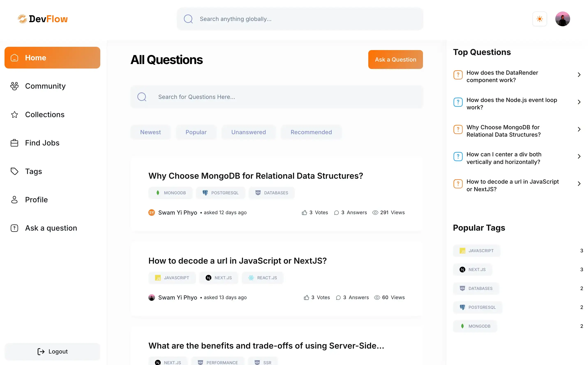
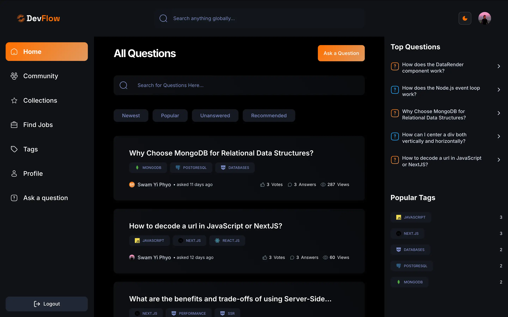
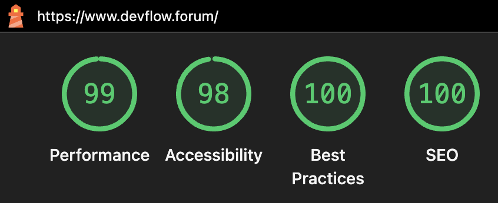

# DevFlow




## Lighthouse Test


## 📚 Table of Contents

- [Overview](#-overview)
- [Challenges](#️-challenges)
- [Lessons Learned](#-lessons-learned)
- [Features](#-features)
- [Usage](#️-usage)
  - [Install Dependencies](#-install-dependencies)
  - [Environment Variables](#-environment-variables)
    - [Next Auth Secret](#next-auth-secret)
    - [Github ID and Secret](#github-id-and-secret)
    - [Google Client ID and Secret](#goolge-client-id-and-secret)
    - [MongoDB URI](#mongodb-uri)
    - [Groq API Key](#groq-api-key)
    - [Rapid API Key](#rapid-api-key)
  - [Run](#️-run)
- [Demo](#-demo)
- [License](#️-license)

## 🚀 Overview

A modern Q&A platform built with **Next.js 15**, **React 19**, and integrated **Groq AI assistance**. Developers can ask questions, share knowledge, and receive intelligent help to improve their queries. The platform emphasizes performance, usability, and clean UI, with a strong focus on scalable architecture and advanced database queries.

## ⚔️ Challenges

One of the core challenges in building DevFlow was designing a scalable and flexible MongoDB schema and choosing between **an array of references** and creating **multiple collections** to manage complex relationships between users, questions, answers, tags, and activity logs. Integrating AI assistance via Groq while maintaining performance and response speed required careful architectural decisions. Implementing an advanced global search system with efficient filtering, sorting, and tag-based recommendation system also lead to late night grinds. Balancing feature-rich functionality with optimal performance, SEO, and clean user experience was a constant challenge.

## 🧠 Lessons Learned

I could spend all day describing the lessons that I learned while working on this project, but the most important ones involved in my newfound understanding of NoSQL database design and advanced aggregation pipelines. Working with Groq AI helped me learn how to integrate AI in a way that adds real value to users. I also learned the importance of code organization, consistent refactoring, and optimizing for readability and scalability. This project taught me how to design a production-grade application that is not only functional but also performant, secure, and SEO-friendly ultimately helping me grow into a more confident and capable full-stack developer.

## ✨ Features

- 🔐 **Authentication with NextAuth** – Supports credentials, Google, and GitHub login.
- 📝 **Ask Questions** – Users can post questions using a rich text editor with **Markdown** support for code blocks.
- 🏷️ **Tagging System** – Add tags to questions for better categorization and discovery.
- 📈 **Voting System** – Upvote or downvote questions and answers based on helpfulness.
- 📁 **Collections** – Save and organize favorite questions into personal collections.
- 💬 **Answer Questions** – Users can contribute answers to help others.
- 🤖 **AI-Generated Answers** – Get smart AI-suggested answers using Groq integration.
- 🔍 **Advanced Filtering & Sorting** – Filter questions by tags, popularity, or recency with seamless pagination.
- 🌐 **Global Job Search** – Search tech jobs across the world with filtering support.
- 🏅 **Reputation & Badges System** – Earn reputation and badges to showcase contributions and activity.
- 🎯 **Tag-Based Recommendations** – Receive recommended questions based on your activity and interests.
- 🛡️ **Protected Routes** – Secure user pages and functionality with route protection.
- ⚙️ **Code Optimization & Refactoring** – Cleaner, more readable code for fewer late-night bugs.
- 🚀 **High Performance & SEO-Friendly** – Fast load times and optimized SEO for discoverability.
- 🎨 **Elegant UI** – Intuitive and user-friendly interface with a developer-focused aesthetic.
- 🧩 **Modular Code Structure** – Well-organized and maintainable project architecture.
- Much more...

## ⚙️ Usage

### 📦 Install Dependencies

```bash
npm install
```

Note: Some dependencies may have not yet been upadated to support React 19. If you get any errors about depencency compatability, run the following:

```bash
npm install --legacy-peer-deps
```
### 🧬 Environment Variables

```bash
NEXTAUTH_SECRET="your-auth-secret"
AUTH_GITHUB_ID="your-github-client-id"
AUTH_GITHUB_SECRET="your-github-secret"
AUTH_GOOGLE_ID="your-google-client-id"
AUTH_GOOGLE_SECRET="your-google-client-secret"
MONGODB_URI="your-mongodb-uri"
GROQ_API_KEY="your-groq-api-key"
NEXT_PUBLIC_RAPID_API_KEY='your-rapid-api-key'
```
#### Next Auth Secret

```bash
npx auth secret
```
This will also add it to your .env file, respecting the framework conventions (eg.: Next.js’ .env.local).

**Example:**

```
NEXTAUTH_SECRET="your_key"
```

#### Github ID and Secret

To obtain your GitHub OAuth credentials, go to your GitHub profile settings, scroll down to “Developer Settings”, then select “OAuth Apps”. Create a new OAuth App, fill in the required fields, and GitHub will provide you with a Client ID and Secret. Paste them into your .env.local file like so:

**Example:**

```
AUTH_GITHUB_ID="your-github-client-id"
AUTH_GITHUB_SECRET="your-github-secret"
```

#### Goolge Client ID and Secret

Navigate to the Google Developer Console, create a new project, and set up a new OAuth client ID. Fill in the necessary information to get your Client ID and Secret Key. Add these credentials to your .env.local file as follows:

**Example:**

```
AUTH_GOOGLE_ID="your-google-client-id"
AUTH_GOOGLE_SECRET="your-google-client-secret"
```

#### MongoDB URI

To connect to MongoDB, sign in at mongodb.com, access MongoDB Atlas under the products section, and create a new cluster. After setup, you’ll get a connection URI, which you should paste into your .env.local file like this:

**Example:**

```
MONGODB_URI="your-mongodb-uri"
```

#### Groq Api Key

Visit groq.com, sign up for an account, and generate an API key from your dashboard. Once you have the key, insert it into your .env.local file:

**Example:**

```
GROQ_API_KEY="your-groq-api-key"
```

#### Rapid Api Key

Go to RapidAPI’s JSearch API, select a pricing plan, and copy your API key. Add this key to your .env.local file as follows:

**Example:**

```
NEXT_PUBLIC_RAPID_API_KEY='your-rapid-api-key'
```

### 🖥️ Run

```bash

# Run in development mode
npm run dev

# Build for production
npm run build

# Run in production mode
npm start

# Export static site
npm run export
```

Open [http://localhost:3000](http://localhost:3000) with your browser to see the result.

## 🌐 Demo

You can now play it around with it. [here](https://www.devflow.forum)

## ⚖️ License

This project is licensed under the [MIT License](LICENSE).

Contact: [swamyiphyo.dev@gmail.com](mailto:swamyiphyo.dev@gmail.com)
